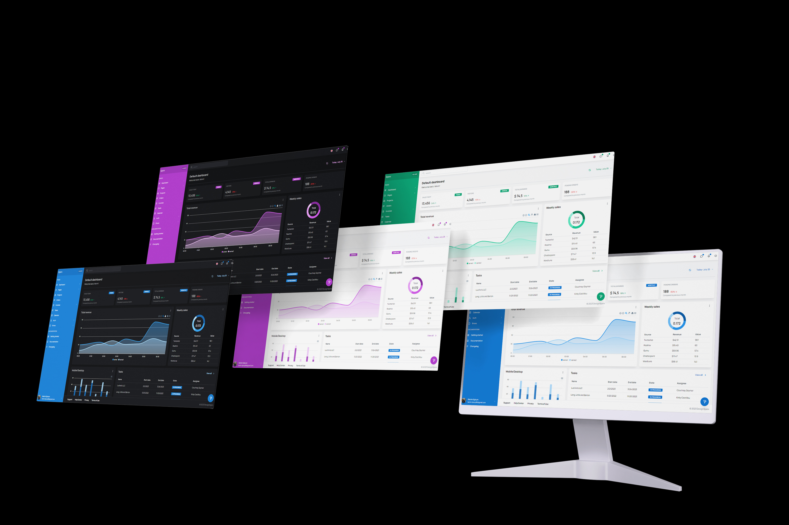
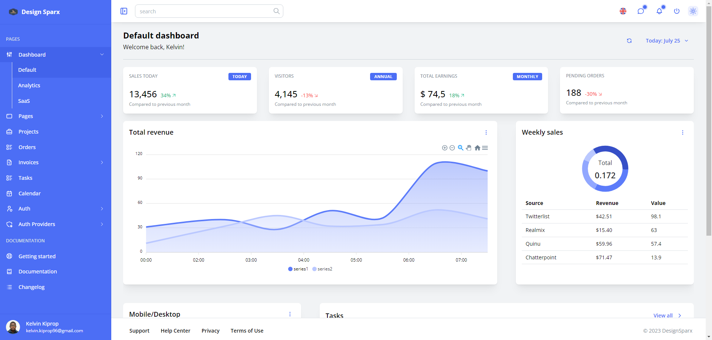

<p align="center">

</p>

<p align="center">
  <a href="https://github.com/design-sparx/mantine-analytics-dashboard/blob/master/LICENSE">
    
  </a>
  <a href="https://github.com/design-sparx/mantine-analytics-dashboard/issues?q=is%3Aopen+is%3Aissue">
    
  </a>
  <a href="https://github.com/design-sparx/mantine-analytics-dashboard/issues?q=is%3Aissue+is%3Aclosed">
    
  </a>
  <a href="https://mantine-analytics-dashboard.netlify.app/" rel="nofollow">
    </a>
  <a href="https://github.com/design-sparx/mantine-analytics-dashboard/archive/refs/heads/ft/readme.zip">
    
  </a>
  <a href="https://app.netlify.com/sites/mantine-analytics-dashboard/deploys">
    
  </a>
  <a href="https://github.com/design-sparx/mantine-analytics-dashboard/actions/workflows/chromatic.yml">
    
  </a>
  <br>
  <a href="https://github.com/design-sparx/mantine-analytics-dashboard">
    
  </a>
</p>

- [Live preview](https://mantine-analytics-dashboard.netlify.app/)
- [Components preview](https://6546507b657a74164abf2db6-oniqlpqtfs.chromatic.com/)
- [Medium](https://medium.com/stackademic/how-i-built-an-open-source-admin-dashboard-template-with-mantine-and-next-js-4f00a21ce04f)
- [Product roadmap](https://kelvink96.notion.site/Mantine-analytics-dashboard-Product-roadmap-822fe0c757e647c9b2fd62a50807500a?pvs=74) * **New** *

# About

A professional admin & dashboard template built using on [Mantine 7](https://mantine.dev/) that comes with hundreds of
UI components, forms, tables, charts, pages and icons. This template is built
using [Next v14](https://nextjs.org/), [React](https://react.dev/), [Apex Charts](https://apexcharts.com/),[Mantine DataTable](https://icflorescu.github.io/mantine-datatable/)
and [Storybook](https://storybook.js.org/).



# Previous release

The previous release of the dashboard template, supports Next 13 with Pages router and Mantine 6. To view the live demo
use this link - [preview](https://652579e5b7998a00083d022b--mantine-analytics-dashboard.netlify.app/), and to checkout
fork the repo use this link - [version 1](https://github.com/design-sparx/mantine-analytics-dashboard/tree/v1)

# Features

- **Customizable:** You don't need to be an expert to customize the template. Our code is very readable and
  well-documented.
- **Fully Responsive:** With mobile, tablet & desktop support it doesn't matter what device you're using. Antd Dashboard
  is responsive in all browsers.
- **Cross-Browser:** Our themes are working perfectly with Chrome, Firefox, Opera, and Edge. We're working hard to
  support them.
- **Clean Code:** We strictly follow Ant Design's guidelines to make your integration as easy as possible. All code is
  handwritten.
- **Regular Updates:** From time to time you'll receive an update containing new components, improvements, and bug
  fixes.

# Tech stack

To make this template awesome, I used the following packages:

## Core

- **Next js v14:** Next.js is an open-source web development framework created by the private company Vercel providing
  React-based web applications with server-side rendering and static website generation.
- **Mantine v7:** Mantine is a React UI components library. It's built on top of React and TypeScript, and provides a
  variety of
  components and hooks for building high-performance web applications.
- **React v18:** React is a free and open-source front-end JavaScript library for building user interfaces based on
  components.
- **Typescript v5:** TypeScript is a free and open-source high-level programming language developed by Microsoft that
  adds static typing with optional type annotations to JavaScript.
- **Storybook v7:** Storybook is a free, open-source tool for developing UI components in isolation. It's used by web
  developers to improve their UI development workflow and build better web applications.
- **Changeset CLI v2:** Changeset is a package that helps in managing my versions and changelogs.
- **NextAuth v4:** NextAuth.js is a flexible and secure authentication library that can be used for client-side
  authentication in Next.js.
- **Tabler icons v2:** Tabler Icons is a free, open-source icon library with over 4,700 icons. The icons are designed
  with a modern aesthetic and are suitable for a wide range of applications.
- **Mantine datatable v7:** Mantine DataTable is a React component that can be used to create data-rich user interfaces.
  It is a table component that is aware of dark themes and is designed for Mantine UI.
- **Lodash v4:** A JavaScript utility library delivering consistency, modularity, performance, & extras.
- **Apex chart v3:s** ApexCharts is a free, open-source JavaScript charting library that allows developers to create
  interactive data visualizations for web pages. It can be used for both commercial and non-commercial projects.
- **Dayjs v1:** Day.js is a JavaScript library that handles dates and times.
- **Tiptap v2:** A headless, framework-agnostic and extendable rich text editor, based on ProseMirror.
- **Fullcalendar v6**: FullCalendar is a JavaScript event calendar with over 300 settings. It's open source and has a
  free core.
- **Dnd-Kit v6:** Dnd-kit is a lightweight, modular, and extensible drag-and-drop toolkit for React. It is also
  accessible and performant.
- **Embla carousel v7:** Embla Carousel is a lightweight carousel library with fluid motion and precise swiping.
- **React simple maps v3:** An svg map chart component built with and for React.
- **Clerk/nextjs v4:** Clerk Next.js is a wrapper around Clerk React. It allows users to use the hooks that Clerk React
  provides.
- **React countup v6:** A React component wrapper around CountUp.js.

## Dev

- **Prettier v3:** Prettier is a code formatter that automatically formats code to ensure it is consistent and easy to
  read.
- **Husky v8:** Husky is a tool that makes it easier to work with git hooks. Prettier is a code formatter.
- **Lint staged v15:** Lint-staged will automatically add any modifications to the commit as long as there are no
  errors.
- **Postcss v8:** PostCSS is a JavaScript library that uses plugins to transform CSS. It transpiles CSS into an abstract
  syntax tree, which is then represented by JavaScript objects.

# Quick start

## Download

- Clone this repo git clone `https://github.com/design-sparx/mantine-analytics-dashboard.git`
- [Download from GitHub](https://github.com/design-sparx/mantine-analytics-dashboard/archive/refs/heads/main.zip)

## Build tools

You'll need to install Node.js.
Once Node.js is installed, run npm install to install the rest of the template's dependencies. All dependencies will be
downloaded to the node_modules directory.

```bash copy
npm install
```

Now you're ready to modify the source files and generate new files. To automatically detect file changes and start a
local webserver at http://localhost:3000, run the following command.

```bash copy
npm run dev
```

Compile, optimize, minify and uglify all source files to build/

```bash copy
npm run build
```

# File structure

Inside the zip-file you'll find the following directories and files. Both compiled and minified distribution files, as
Inside the zip file, you'll find the following directories and files. Both compiled and minified distribution files, as
well as the source files are included in the package.

```
mantine-analytics-dashboard/
├── .changeset
├── .github
├── .gitignore
├── .editorconfig
├── .prettierignore
├── .prettierrc
├── README.md
├── CHANGELOG.md
├── LICENSE
├── index.html
├── package.json
├── tsconfig.json
├── next.config.js
├── postcss.config.cjs
├── clerkMiddleware.ts
├── yarn.lock
├── public/
│   ├── mocks/
│   ├── _redirects
│   ├── favicon.ico
├── src/
│   ├── .changeset/
│   ├── .github/
│   ├── .husty/
│   ├── .storybook/
│   ├── .yarn/
│   ├── app/
├────── api/
├────── error.tsx
├────── error.module.css
├────── global.css
├────── layout.tsx
├────── loading.tsx
├────── not-found.tsx
├────── page.module.css
├────── page.tsx
│   ├── components/
│   ├── hooks/
│   ├── layout/
│   ├── providers/
│   ├── public/
│   ├── routes/
│   ├── styles/
│   ├── theme/
│   ├── types/
│   ├── utils/
└──
```

# Contributing and Support

I welcome all developers and enthusiasts to contribute to the growth of our open-source admin dashboard template.
Contributing is a collaborative process that empowers us to collectively enhance the template’s capabilities and
quality. To get started:

- Fork the Repository: Fork the template’s GitHub repository to your own GitHub account.
- Clone the Fork: Clone the forked repository to your local machine using Git.
- Create a Branch: Create a new branch for your contributions to keep the main codebase intact.
- Implement Changes: Make your desired changes, add new components, or refine existing features.
- Commit and Push: Commit your changes to the new branch and push them to your GitHub fork.
- Submit a Pull Request: Submit a pull request from your forked repository to the main template repository. Your changes
  will be reviewed and potentially merged.

# Reporting Issues and Seeking Help

Should you encounter any issues or need assistance while using the template, we’re here to help:

- Issue Tracker: Visit the GitHub
  repository’s [Issues](https://github.com/design-sparx/mantine-analytics-dashboard/issues) tab to report bugs, suggest
  enhancements, or seek clarification on aspects of the template.
- Community Interaction: Engage with the template’s community on platforms
  like [GitHub Discussions](https://github.com/design-sparx/mantine-analytics-dashboard/discussions) for assistance,
  guidance, and insights.

# Invitation to Explore and Utilize

The Mantine and Next.js admin dashboard template isn’t just an end; it’s a beginning — a starting point for your
creative journey. Whether you’re a seasoned developer seeking a rapid launch or an enthusiast keen on learning modern
development practices, this template is your canvas.

# Further resources

- Nextjs - [https://nextjs.org/docs](https://nextjs.org/docs)
- React - [https://react.dev/learn](https://react.dev/learn)
- Mantine - [https://mantine.dev/getting-started/](https://mantine.dev/getting-started/)
- Nextauth - [https://authjs.dev/](https://authjs.dev/)
- Storybook - [https://storybook.js.org/docs/get-started/install](https://storybook.js.org/docs/get-started/install)
- Apexcharts - [https://apexcharts.com/docs/installation/](https://apexcharts.com/docs/installation/)
- Tiptap - [https://tiptap.dev/introduction](https://tiptap.dev/introduction)
- Dndkit - [https://docs.dndkit.com/](https://docs.dndkit.com/)
- Embla carousel - [https://www.embla-carousel.com/get-started/](https://www.embla-carousel.com/get-started/)
- Fullcalendar - [https://fullcalendar.io/docs/getting-started](https://fullcalendar.io/docs/getting-started)
- React simple
  maps - [https://www.react-simple-maps.io/docs/getting-started/](https://www.react-simple-maps.io/docs/getting-started/)
